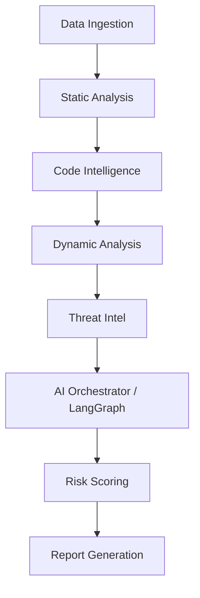

# Sephela

**Enterprise platform for GenAI-based automated analysis & risk scoring of fraudulent Android APKs** — built for banking cybersecurity teams.

## Architecture: Data Ingestion to Report Generation

Sephela follows a sequential, multi-engine pipeline to extract, analyze, enrich, and summarize indicators of compromise (IOCs) from Android applications.

### 1. Data Ingestion
- **Intake:** The user uploads an APK via the frontend React UI or API. 
- **Storage:** The file is persisted (S3 for prod, local disk for demo).
- **Queueing:** A Postgres record is created, and the job is dispatched to Celery workers backed by Redis.

### 2. Static Analysis
- Decompiles the APK using JADX.
- Parses `AndroidManifest.xml` for permissions, entry points, and configurations.
- Extracts raw strings, hardcoded secrets, and URLs.

### 3. Code Intelligence
- Scans the decompiled Java/Kotlin AST for high-signal code patterns (e.g., evasion techniques, dynamic class loading, SMS interception).
- Filters out noise and hands off a summarized code context for the AI agents.

### 4. Dynamic Analysis
- Runs the APK in an isolated KVM Android sandbox to capture runtime behaviors (network traffic, file system modifications, IPC calls).

### 5. Threat Intel
- Extracts domains, IPs, URLs, and file hashes from previous stages.
- Queries external OSINT APIs (VirusTotal, AbuseIPDB, URLHaus) for reputation data.

### 6. AI Orchestrator (Multi-Agent Reasoning)
- Built on LangGraph, utilizing 6 specialized parallel agents: **Manifest, Permission, Code, API, Network, Threat Intel**.
- The agents analyze the evidence, correlate findings, and generate a narrative.
- Output is strictly validated via Pydantic schemas before being trusted.

### 7. Risk Scoring
- A deterministic, LLM-free rule engine. It calculates an explainable 0-100 risk score based on the combined evidence from the analysis engines and AI findings.

### 8. Report Generation
- Finalizes the job and compiles the evidence into SOC-ready formats: HTML, Markdown, JSON, and SARIF.

---

## Current Status (Demo Readiness)

We have heavily tailored this environment to ensure a flawless, fast-paced presentation. Here is what is working perfectly, and what has been explicitly bypassed or disabled.

### ✅ What is Working Perfectly

* **The Core Pipeline:** Intake, Static Analysis, Code Intel, Risk Scoring, and Report Generation are running smoothly.
* **GenAI Multi-Agent Reasoning:** Fully operational. We are routing prompts through OpenRouter using the `nvidia/nemotron-3-ultra-550b-a55b:free` model. The AI successfully enriches findings without hallucinating unsupported evidence.
* **Threat Intel (Demo Mode):** Fully operational and exceptionally fast. We have intentionally **ripped out the API rate limiters** (which normally wait 15+ seconds between VirusTotal requests) and implemented a custom round-robin load balancer. 
  * *Why?* To blast through 100+ indicators instantly during your presentation. 
  * *UI Note:* Any API rate-limit errors (HTTP 429) from the providers are intentionally suppressed from the UI to keep the dashboard green and clean.
* **Observability:** Prometheus and Grafana are configured, and the Celery workers are correctly exposing metrics on port `9100`.
* **Database & Concurrency:** Async SQLAlchemy race conditions ("Session already flushing") have been patched.

### ❌ What is Not Working / Disabled

* **Dynamic Analysis:** Off by default (`SEPHELA_DYNAMIC_ENABLED=false`). True dynamic analysis requires KVM and nested virtualization for the Android emulator, which is complex to guarantee on local dev environments (WSL2).
* **Strict Threat Intel Quotas:** In a true production environment, the Threat Intel engine uses a strict `TokenBucket` rate limiter to avoid exhausting free-tier quotas. We disabled this for the sake of the demo's speed.
* **Production K8s / Terraform:** Kubernetes manifests and deployment scripts exist in `infra/` but are currently unvalidated against a live cluster. We are relying entirely on `docker compose` for the presentation.
* **PDF Report Generation:** While HTML, JSON, and Markdown work perfectly, PDF generation depends on the OS-level `weasyprint` libraries which may fail if font dependencies are missing on the host.

## Running the Demo

1. Ensure your `.env` is configured with `MANIFEST_MODEL=nvidia/nemotron-3-ultra-550b-a55b:free` (already done).
2. Start the stack: `docker compose -f infra/compose/docker-compose.yml up -d --build api worker`
3. Access the UI at `http://localhost:3000`.
4. Upload your APK and watch the pipeline fly!
